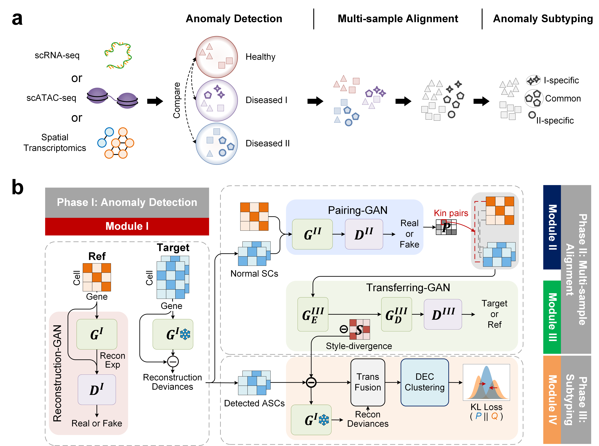

# Detecting and subtyping anomalous single cells with M2ASDA
Detecting and identifying anomalous single cells from single-cell datasets is crucial for understanding molecular heterogeneity in diseases and promoting precision medicine. No existing method unifies multimodal and multi-sample anomaly detection and identification, involving crucial tasks like anomaly detection, alignment, and annotation. We propose an innovative Generative Adversarial Network-based framework named Multimodal and Multi-sample Anomalous Single-cell Detection and Annotation (M2ASDA), integrating solutions of these crucial tasks into a unified framework. Comprehensive tests on real datasets demonstrate M2ASDA's superior performance in anomaly detection, multi-sample alignment, and identifying common and specific cell types across multiple target datasets.
 

 

## Framework of M2ASDA
M2ASDA is an innovative framework built on a suite of specialized Generative Adversarial Networks (GANs) for seamlessly integrating the three tasks of DDATD. The framework consists of three components. 

<i>Component I</i> (C1) trains a GAN model on the reference dataset, learning to reconstruct normal cells from their multimodal representations of both spatial transcriptomics data and associated histology image. Subsequently, the model is applied on the target datasets to identify anomalous spots as those with unexpectedly large reconstruction deviances, namely anomaly scores.

<i>Component II</i> (C2) aims at diminishing the non-biological variations (e.g. batch effects) among anomalies via aligning target datasets in a common space. It employs two cooperative GAN models to identify pairs of reference and target spots that share similar biological contents, based on which the target datasets are aligned to the reference data space via “style-transfer”.

<i>Component III</i> (C3) fuses the embeddings and reconstruction residuals of aligned anomalous spots to serve as inputs to an iterative clustering algorithm which groups anomalies into distinct subtypes. 

## Source codes
All the source codes of M2ASDA are available on [GitHub](https://github.com/Catchxu/M2ASDA).

## Contributors
- [Kaichen Xu](https://github.com/Catchxu): Lead Developer, implement M2ASDA and design this website.
- [Kainan Liu](https://github.com/LucaFederer): Developer, have diverse contributions.
- Xiaobo Sun & lab: provide guidance, support and environment.

## Citation
Coming soon.